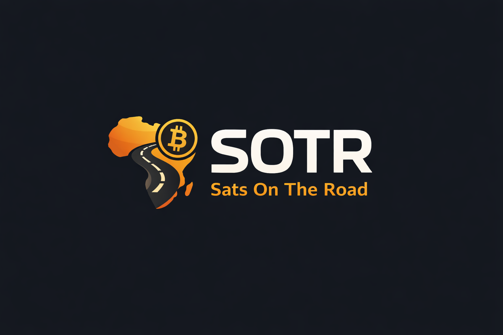

# Shot List

A reusable shot list so every country episode has the same shape. Capture these
wherever you can. Not every stop will have all of them, and that is fine, but aim
for this set so the episodes feel like one series. Always follow the consent rule
in [`../safety/consent-form.md`](../safety/consent-form.md): get consent, and blur
faces of anyone who did not give it.

| # | Shot | What to capture | Notes |
|--:|------|-----------------|-------|
| 1 | **Arrival** | The wrapped vehicle rolling into town, the team getting out | Sets the place. Grab a sign or landmark with the town name. |
| 2 | **Market** | The market or venue before the class, everyday trade | Wide shots, and a few close details (hands, goods, stalls). |
| 3 | **Teaching** | A session in progress, the facilitator and learners | Show faces only with consent. Capture the energy of the room. |
| 4 | **Wallet setup moment** | Someone setting up their first wallet | The screen and their reaction. This is the heart of Day 1. |
| 5 | **First payment** | A real ⚡ Lightning payment happening | Both phones, the QR scan, the confirmation. Keep it real. |
| 6 | **Merchant onboarding** | A merchant putting up the "Bitcoin accepted here" sign | The sign going on the wall, the first sale in sats. |
| 7 | **Interview** | A short piece-to-camera from a learner, ambassador or merchant | One clear question: what changed for you? Consent first. |
| 8 | **Landscape / road b-roll** | The road, the countryside, the next town ahead | Quiet shots to breathe between segments and to open or close. |
| 9 | **Sign-off** | A closing shot, the team or vehicle leaving | Mirrors the arrival. Leaves the viewer with the place. |

## Practical notes

- Shoot horizontal for the main episode. Grab a few vertical clips for social.
- Record a little room tone and ambient market sound; it helps the edit.
- Keep a quick note of who appears and whether they consented, so the editor knows
  which faces to blur.
- Capture the local currency and price examples where you can (a price tag, a
  receipt), it makes the sats concrete for viewers.
